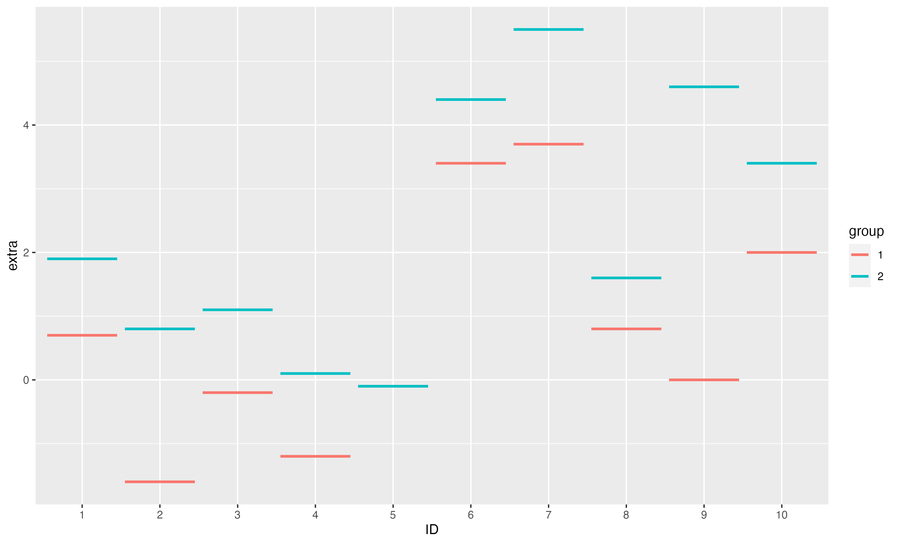
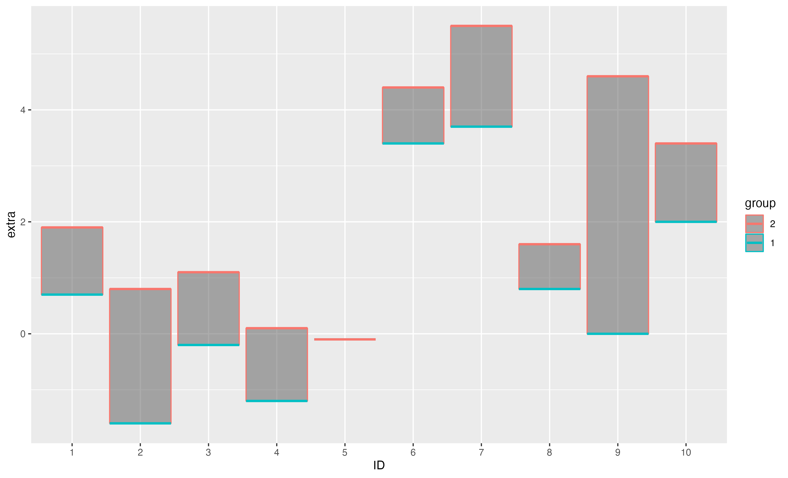
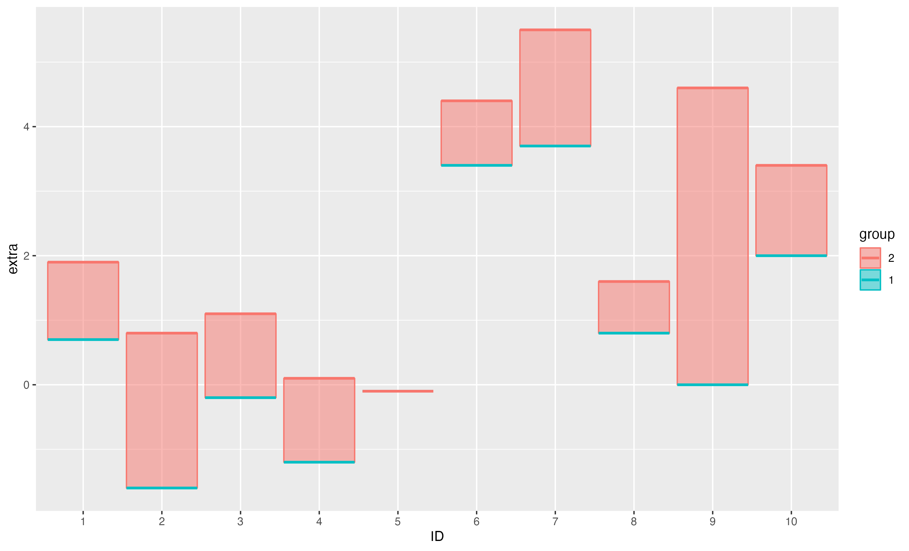
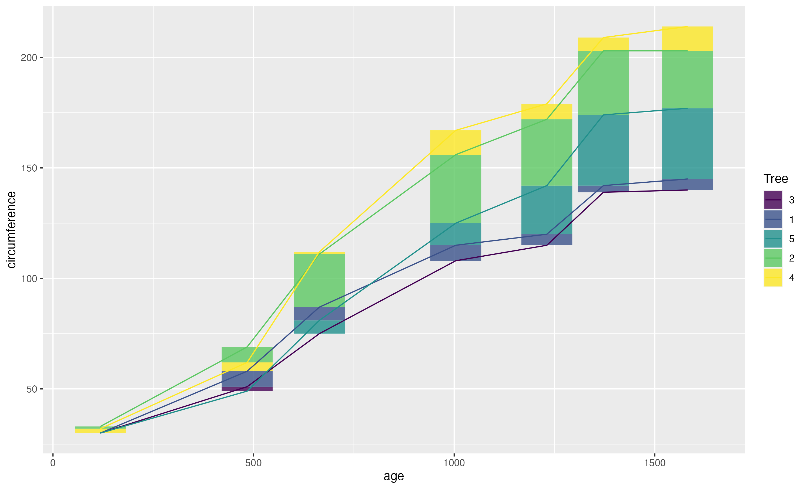

# ggfloatbar

## Instalation

Install the latest version of this package from Github by pasting in the following.

~~~R
devtools::install_github("abikoushi/ggfloatbar")
~~~

## Gallery

~~~R
library(ggfloatbar)
ggplot(sleep, aes(x=ID, y=extra, colour=group))+
  geom_float()
~~~

~~~R
ggplot(sleep, aes(x=ID, y=extra, colour=group))+
  geom_floatbar(alpha=0.5)+
  geom_float()
~~~

~~~R
ggplot(sleep, aes(x=ID, y=extra, colour=group, fill=group))+
  geom_floatbar(alpha=0.5)+
  geom_float()
~~~

~~~R
ggplot(Orange,aes(x = age, y = circumference)) +
  geom_floatbar(aes(fill = Tree), alpha=0.8)+
  geom_line(aes(color = Tree))
~~~

